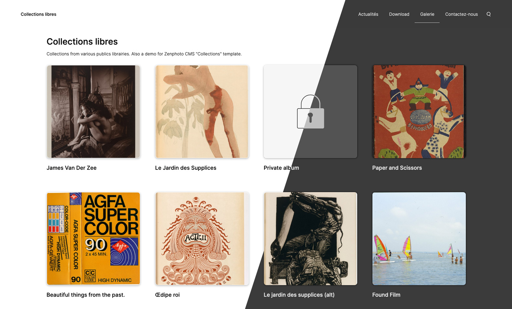

# Collections, a theme for ZenphotoCMS
**[Collections](https://collections.rolandtisserand.fr/)** is a responsive theme for ZenphotoCMS image gallery and CMS. 

## Supported plugins
* cacheManager
* class-textobject
* class-video
* comment_form
* contact_form
* favoritesHandler (*no Multiple sets in v.1*)
* menu_manager (*no submenu see ⤵)
* openstreetmap
* rating
* register_user
* related_items
* tag_suggest
* themeSwitcher
* user_ login_out
* zenpage

## Supported options
* Responsive images using `srcset`
* Dark / Light theme with `prefers-color-scheme`
* Accessible & responsive navbar
* SVG icons hack with CSS (empty, protected, text... will add more) 

## Installation
Put `collections` folder in ZenphotoCMS `/themes/` folder.

Activate it through ZenphotoCMS admin. A custom menu will be generate.

## What next ?
* Dark / Light switcher with cookie.
* Better accessibility
* Handling favorite plugin with multiple sets
* Choose homepage
* Finding a way to standardize class for sub-menu with `menu_manager` so it can handle accessible navigation with keyboard.
* Fix the space in picture URI due to `&dsp=Protected view`