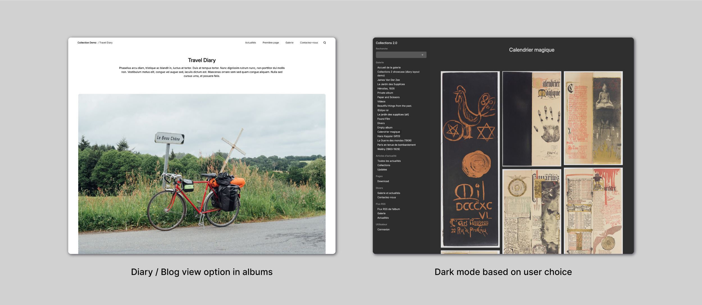

# Collections, a theme for ZenphotoCMS

**[Collections](https://collections.rolandtisserand.fr/)** is a responsive theme for ZenphotoCMS image gallery and CMS.  🖥 Demo with all plugins active : [https://collections.rolandtisserand.fr/](https://collections.rolandtisserand.fr/)

## 🧩 Supported plugins

* cacheManager
* class-textobject
* class-video
* comment_form
* contact_form
* favoritesHandler
* menu_manager (*no submenu see* ⤵)
* multiple_layouts
* openstreetmap
* rating
* register_user
* related_items
* tag_suggest
* themeSwitcher
* user_ login_out
* zenpage

## 🚀🚀 Improvements & options

* Responsive images using `srcset`
* Dark / Light theme with `prefers-color-scheme`
* Accessible & responsive navbar
* SVG icons hack with CSS (empty, protected, text... will add more)
* Show / Hide title & description for Album view 

## 🏗 Installation

Upload `collections` folder to `/themes/` folder.
Activate it through admin panel.
